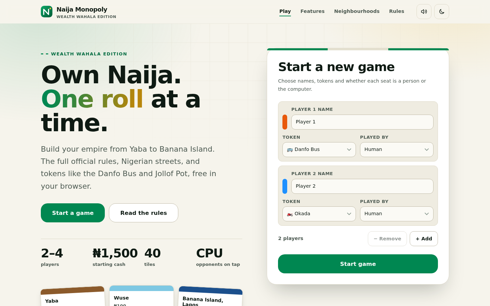
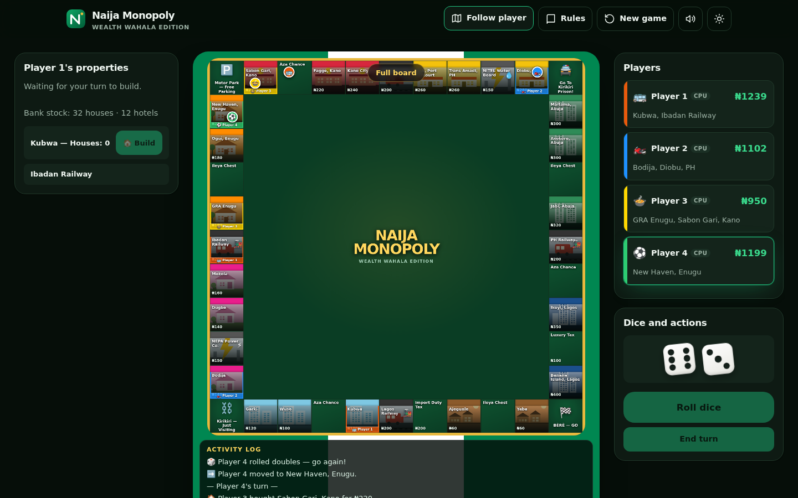

<div align="center">

<picture>
  <source media="(prefers-color-scheme: dark)" srcset="docs/assets/logo-dark.svg">
  
</picture>

**Own Naija, one roll at a time.** A Nigerian-themed Monopoly with the full official rules, free in your browser.

[](https://github.com/babatundeawo/naija-monopoly/actions/workflows/deploy.yml)
[](https://babatundeawo.github.io/naija-monopoly/)
[](LICENSE)

[**Play now**](https://babatundeawo.github.io/naija-monopoly/) · [Customize](docs/CUSTOMIZING.md) · [Report an issue](https://github.com/babatundeawo/naija-monopoly/issues/new/choose)

</div>



## About

Naija Monopoly (Wealth Wahala Edition) takes the classic property-trading game to Nigeria. You buy streets from Yaba to Banana Island, ride the Lagos and Kano railways, and pay NEPA when the light is on. It is for two to four players on one device, with any seat playable by a person or the computer. It is a fan-made, unofficial parody and is not affiliated with Hasbro.

## Features

- The full official rule set: ₦1,500 starting cash, ₦200 for passing GO, doubles, jail, taxes and bankruptcy
- Auctions when a player declines to buy, open to every player
- Houses and hotels with even building and a limited bank supply of 32 houses and 12 hotels
- Mortgages (unmortgage at the mortgage value plus 10%) and player-to-player trades of property and cash
- Computer opponents that roll, buy, bid and answer trade offers
- Nigerian flavour throughout: Aza Chance and Ileya Chest cards, Kirikiri Prison, NEPA and NITEL, and tokens such as the Danfo Bus, Okada and Jollof Pot
- Synthesised sound effects you can mute, and a camera that follows the active player or shows the whole board
- Light and dark themes, keyboard-friendly controls and a layout that works from phones to wide screens
- Also packaged as a Windows desktop app, built by the repository's *Build Windows EXE* workflow



## How to use it

1. Open the [live site](https://babatundeawo.github.io/naija-monopoly/).
2. Choose two to four players. Give each a name and a token, and decide whether a person or the computer plays that seat.
3. Select **Start game**, then **Roll dice** on your turn. Landing on a property lets you buy it or send it to auction.
4. Select any property tile to read its deed. Use the left panel to build, and **Propose trade** to deal with another player.
5. The last player who is not bankrupt wins. Open **Rules** at any time for a reminder.

## Tech stack

- Plain HTML, CSS and JavaScript, with no framework and no runtime dependencies
- [Electron](https://www.electronjs.org/) and electron-builder for the Windows app
- GitHub Actions and GitHub Pages for building and hosting
- Fonts: Bricolage Grotesque and Plus Jakarta Sans, loaded from Google Fonts

## Project structure

```
src/                  The website and game
  index.html          Page markup and all page text
  css/                Design tokens, base styles, site and game styles
  js/                 Game rules (engine.js), board, rendering, audio and page behaviour
  assets/             Logo, icons and social preview image
scripts/              Build and check scripts used by GitHub Actions
docs/                 Guides and screenshots
main.js               Electron entry point for the Windows app
.github/              Workflows, Dependabot and issue templates
```

## Contributing

Found a bug or have an idea? [Open an issue](https://github.com/babatundeawo/naija-monopoly/issues/new/choose) on GitHub. To change something yourself, edit a file with the pencil icon on GitHub and propose the change as a pull request. See [CONTRIBUTING.md](CONTRIBUTING.md) for details.

## Security

Please report vulnerabilities privately. See [SECURITY.md](SECURITY.md).

## License and credits

Released under the [MIT License](LICENSE).

- Fonts: [Bricolage Grotesque](https://fonts.google.com/specimen/Bricolage+Grotesque) and [Plus Jakarta Sans](https://fonts.google.com/specimen/Plus+Jakarta+Sans), both under the SIL Open Font License
- Interface icons are simple line icons adapted from [Feather](https://feathericons.com/) (MIT)
- Tokens and card art use system emoji and illustrations drawn for this project
